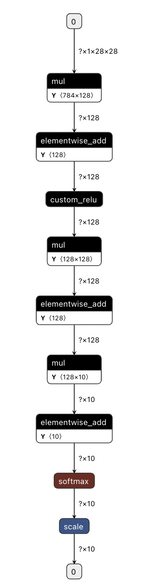
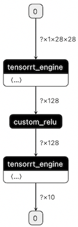
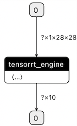

# 自定义算子模型构建运行示例

## 一：获取本样例中的自定义算子模型
下载地址：https://paddle-inference-dist.bj.bcebos.com/inference_demo/custom_operator/custom_relu_infer_model.tgz

执行 `tar zxvf custom_relu_infer_model.tgz` 将模型文件解压至当前目录。

## 二：**样例编译**

文件 `custom_relu_op.cc`、`custom_relu_op.cu` 为自定义算子源文件，自定义算子编写方式请参考[飞桨官网文档](https://www.paddlepaddle.org.cn/documentation/docs/zh/guides/index_cn.html)。
注意：自定义算子目前需要与飞桨预测库 `libpaddle_inference.so` 联合构建。

文件`custom_op_test.cc` 为预测的样例程序。
文件`CMakeLists.txt` 为编译构建文件。
脚本`compile.sh` 包含了第三方库、预编译库的信息配置。

我们首先需要对脚本`compile.sh` 文件中的配置进行修改。

1）**修改`compile.sh`**

打开`compile.sh`，我们对以下的几处信息进行修改：

```shell
# 根据预编译库中的version.txt信息判断是否将以下三个标记打开
WITH_MKL=ON
WITH_GPU=ON
USE_TENSORRT=OFF

# 配置预测库的根目录
LIB_DIR=${work_path}/../lib/paddle_inference

# 如果上述的WITH_GPU 或 USE_TENSORRT设为ON，请设置对应的CUDA， CUDNN， TENSORRT的路径。
CUDNN_LIB=/usr/lib/x86_64-linux-gnu/
CUDA_LIB=/usr/local/cuda/lib64
TENSORRT_ROOT=/usr/local/TensorRT-7.1.3.4
```

运行 `bash compile.sh`， 会在目录下产生build目录。


2） **运行样例**

```shell
# 运行样例
./build/custom_op_test
```

运行结束后，程序会将模型结果打印到屏幕，说明运行成功。

> 注：确保路径配置正确后，也可执行执行 `bash run.sh` ，一次性完成以上两个步骤的执行

## 三：**为自定义算子添加 TensorRT Plugin 实现**
当模型运行在 TensorRT 后端时，为了充分发挥 TensorRT 的性能，期望模型全图跑在 TensorRT 上，对于自定义算子而言，Paddle Inference 推理默认并非支持将自定义算子映射 TensorRT 的 Layer 中。

以上述的自定义算子模型为例：

模型的结构图如图所示：



当 Paddle Inference 开启 TensorRT 后， 由于 Paddle Inference 是以子图方案接入的 TensorRT 后端，故经过 TensorRT 优化后的模型的结构图如下所示：



从图中可知，由于 TensorRT 不支持我们的自定义算子，故将模型分成了两个 tensorrt_engine：在 custom_relu 之前的算子融合为一个 tensorrt_engine，在 custom_relu 之后的算子融合为另一个 tensorrt_engine。

为了充分发挥 TensorRT 的性能， 期望模型中的算子全部融合为一个 tensorrt_engine。只需为自定义算子 custom_relu 撰写对应的 Plugin 即可。

对于静态 shape 输入的模型， Paddle Inference 内部的 Plugin 以 IPluginV2Ext 为基类，为保持和 Paddle Inference 的一致性，自定义算子的 Plugin 也应当以此为基类。custom_relu 对应静态 shape Plugin 的具体实现在文件 `custom_relu_op_plugin.h`以及`custom_relu_op_plugin.cu`中， 对应的动态 shape Plugin 的实现在 `custom_relu_op_dynamic_plugin.h` 及 `custom_relu_op_dynamic_plugin.cu`中。实现过程需要注意的以下几点：

  1. 静态 shape 输入的 Plugin 应以 IPluginV2Ext 为基类， 动态 shape 输入的 Plugin 应以 IPluginV2DynamicExt 为基类；
  2. 静态 shape 输入的 Plugin 命名方式为 `op_name + _paddle_trt_plugin`, 如本 demo 中“custom_relu_paddle_trt_plugin”；
  3. 动态 shape 输入的 Plugin 命名方式为 `op_name + _paddle_trt_dynamic_plugin`, 如本 demo 中的“custom_relu_paddle_trt_dynamic_plugin”；
  4. Inference 内部会调用 `CustomReluPluginCreator::createPlugin()` 接口创建 Plugin，务必正确实现该接口。

Plugin 的总体实现原则完全依照官方文档 [Extending TensorRT with Custom Layers](https://docs.nvidia.com/deeplearning/tensorrt/developer-guide/index.html#extending)，不需要依赖 Paddle Inference，与 Paddle Inference 无关。实现完成后使用官方提供的`REGISTER_TENSORRT_PLUGIN`
完成对应 PluginCreator 的注册。

Paddle Inference 框架内部根据自定义 Op 的名字，找到对应的 PluginCreator，然后调用 `createPlugin()`完成 Plugin 的创建。

本 Demo 中， 添加 `custom_relu_op_plugin.h`和`custom_relu_op_plugin.cc` 以及 `custom_relu_op_dynamic_plugin.h`, `custom_relu_op_dynamic_plugin.cu`后，需在 `CMakeLists.txt`编译 Plugin 动态库，然后将可执行文件与生成的`libcustom_plugin.so`, `libcustom_dynamic_plugin.so` 完成链接， 便可使用对应的静/动态 Plugin,。`CMakeLists.txt` 的修改如下所示
```bash
cuda_add_library(pd_infer_custom_op ${CUSTOM_OPERATOR_FILES} SHARED)
cuda_add_library(custom_plugin custom_relu_op_plugin.cu SHARED)
cuda_add_library(custom_dynamic_plugin custom_relu_op_dynamic_plugin.cu SHARED)
add_executable(${DEMO_NAME} ${DEMO_NAME}.cc)
set(DEPS ${DEPS} pd_infer_custom_op custom_plugin custom_dynamic_plugin)
```

编译成功后、运行，便可将所有的 Op 融合为一个 tensorrt_engine，如下图所示：



## 更多链接
- [Paddle Inference使用Quick Start！](https://paddle-inference.readthedocs.io/en/latest/introduction/quick_start.html)
- [Paddle Inference C++ Api使用](https://paddle-inference.readthedocs.io/en/latest/api_reference/cxx_api_index.html)
- [Paddle Inference Python Api使用](https://paddle-inference.readthedocs.io/en/latest/api_reference/python_api_index.html)
