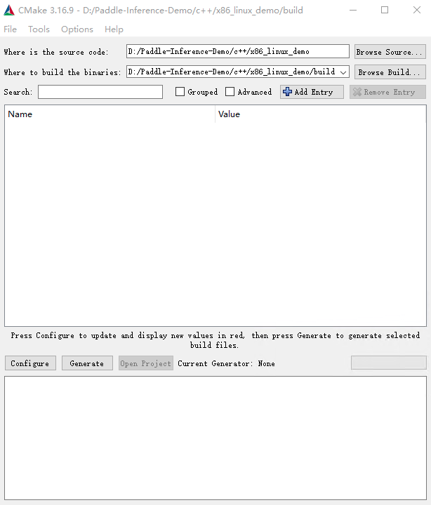
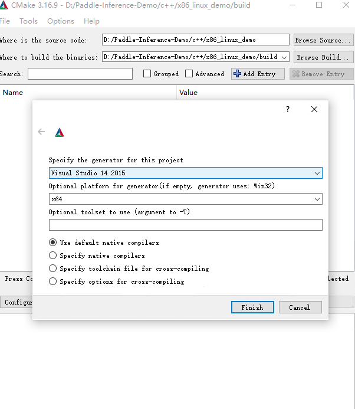
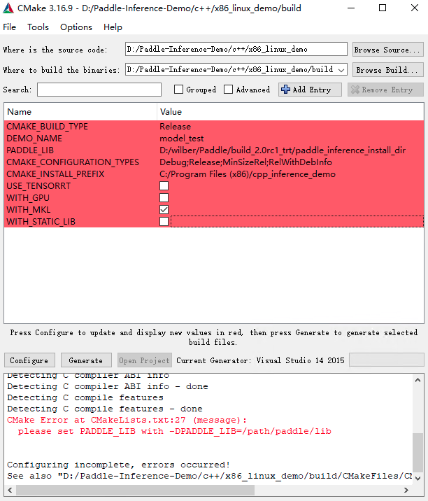
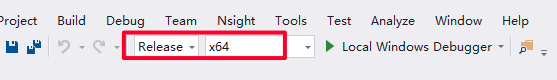
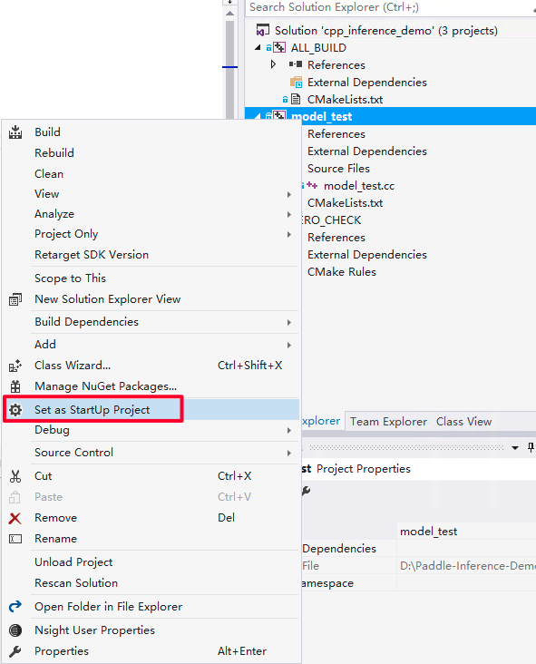
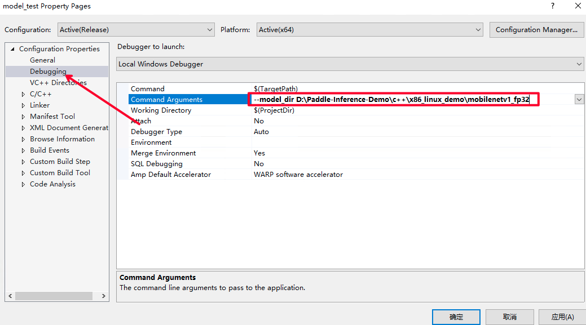
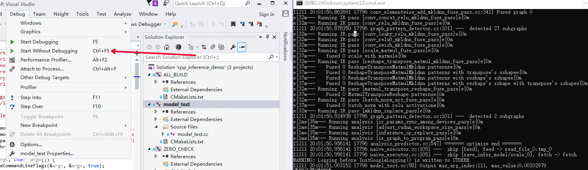

# GPU 原生推理

使用 GPU 原生推理前必须确保您的机器上已经安装了 CUDA 和 cuDNN，且需要知道它们的安装位置。

使用 PaddlePaddle 训练结束后，得到推理模型，可以用于推理部署。
本文准备了 mobilenet_v1 推理模型，可以从[链接](https://paddle-inference-dist.cdn.bcebos.com/PaddleInference/mobilenetv1_fp32.tar.gz)下载，或者 wget 下载。

```shell
wget https://paddle-inference-dist.cdn.bcebos.com/PaddleInference/mobilenetv1_fp32.tar.gz
```

下面分别介绍在 Linux/Ubuntu 操作系统下和 Windows 操作系统下用 GPU 原生推理的 C++ 和 Python 示例。

## 1 C++ 示例

C++ 示例代码在[链接](https://github.com/PaddlePaddle/Paddle-Inference-Demo/tree/master/c%2B%2B/cuda_linux_demo)，你可以将此仓库全部克隆下来留着使用。下面从先介绍 Paddle Inference C++ API 的使用流程，然后介绍在 Linux/Ubuntu 系统下和 Windows 系统下编译和执行此示例代码。

&emsp;

使用 Paddle Inference C++ API 的典型过程包含下面六个步骤。
完整代码在示例中的`model_test.cc`。

(1) 包含头文件

使用 Paddle Inference 推理库，只需包含 `paddle_inference_api.h`。

```cpp
#include "paddle/include/paddle_inference_api.h"
```

(2) 设置 Config

根据推理部署的实际情况，设置 Config，用于后续创建 Predictor。

Config 默认用 CPU 推理，若要用 GPU，需手动开启，设置分配的初始显存 和 运行的 GPU 卡号。同时可以设置开启 IR 优化、开启内存优化、开启 TensorRT 加速等。Paddle Inference 中启用 TensorRT 的相关说明和示例可以参考[文档](https://paddle-inference.readthedocs.io/en/master/optimize/paddle_trt.html)。

```cpp
paddle_infer::Config config;
if (FLAGS_model_dir == "") {
config.SetModel(FLAGS_model_file, FLAGS_params_file); // Load combined model
} else {
config.SetModel(FLAGS_model_dir); // Load no-combined model
}
config.EnableUseGpu(500, 0);
config.SwitchIrOptim(true);
config.EnableMemoryOptim();
config.EnableTensorRtEngine(1 << 30, FLAGS_batch_size, 10, PrecisionType::kFloat32, false, false);
```

如果您不想使用 TensorRT 加速，仅想用 GPU 原生推理，请注释掉`config.EnableTensorRtEngine();` 这行。

(3) 创建 Predictor

```cpp
std::shared_ptr<paddle_infer::Predictor> predictor = paddle_infer::CreatePredictor(config);
```

(4) 设置输入

从 Predictor 中获取输入的 names 和 handle，然后设置输入的 shape 和输入的数据。

```cpp
auto input_names = predictor->GetInputNames();
auto input_t = predictor->GetInputHandle(input_names[0]);
std::vector<int> input_shape = {1, 3, 224, 224};
std::vector<float> input_data(1 * 3 * 224 * 224, 1);
input_t->Reshape(input_shape);
input_t->CopyFromCpu(input_data.data());
```

(5) 执行Predictor

```cpp
predictor->Run();
```

(6) 获取输出

```cpp
auto output_names = predictor->GetOutputNames();
auto output_t = predictor->GetOutputHandle(output_names[0]);
std::vector<int> output_shape = output_t->shape();
int out_num = std::accumulate(output_shape.begin(), output_shape.end(), 1,
                              std::multiplies<int>());
std::vector<float> out_data;
out_data.resize(out_num);
output_t->CopyToCpu(out_data.data());
```

### Linux/Ubuntu 部署示例

请参考[下载安装 Ubuntu 推理库](https://paddleinference.paddlepaddle.org.cn/user_guides/download_lib.html#linux)下载 C++ 推理库，名称中带有 `cuda` 的为用于 GPU 的推理库。以 `manylinux_cuda11.2_cudnn8.2_avx_mkl_trt8_gcc8.2`为例，它要求您的系统上安装 CUDA 版本为11.2，cuDNN 版本为8.2， TensorRT 版本为8.x， gcc 版本为8.2，当然，如果您的上述版本不能完全对应，那么或许也是可以的。注意，如果您的机器上没有安装 TensorRT，您仍然可以下载这个库，只不过模型就只能用 GPU 原生推理，而不能使用 TensorRT 加速。


下面介绍示例代码在 Linux/Ubuntu 下的编译和执行。
您需要关心下面四个文件即可，首先进入 C++ 示例代码的目录。
文件`model_test.cc` 为推理的样例程序（程序中的输入为固定值，如果您有opencv或其他方式进行数据读取的需求，需要对程序进行一定修改）。    
文件`../lib/CMakeLists.txt` 为编译构建文件，
脚本 `compile.sh` 为编译脚本，它将复制`../lib/CMakeLists.txt`到当前目录，并编译生成可执行文件。
脚本`run.sh` 下载模型，并运行可执行程序。

先要把您下载好的 Paddle Inference 推理库放到`Paddle-Inference-Demo/c++/lib`中，然后在 `compile.sh` 里面进行如下设置。
如果您不想使用 TensorRT 或机器上没有安装 TensorRT，那您要记得把`USE_TENSORRT`置为`OFF`。`LIB_DIR`就是您的 Paddle Inference 推理库的放置路径，`CUDNN_LIB`、`CUDA_LIB`、`TENSORRT_ROOT`分别为您的 cuDNN 的库路径，CUDA 的库路径，以及 TensorRT 的根目录。

```shell
WITH_MKL=ON
WITH_GPU=ON
USE_TENSORRT=OFF

LIB_DIR=${work_path}/../lib/paddle_inference
CUDNN_LIB=/usr/lib/x86_64-linux-gnu/
CUDA_LIB=/usr/local/cuda/lib64
TENSORRT_ROOT=/usr/local/tensorrt
```

最后只需两个命令即可完成编译和执行。

```shell
bash compile.sh
bash run.sh
```

运行结束后，程序会将模型结果打印到屏幕，说明运行成功。

### Windows 上 GPU 原生推理部署示例

请参考[下载安装 Windows 推理库](https://paddleinference.paddlepaddle.org.cn/user_guides/download_lib.html#windows)下载 C++ 推理库。

在 Windows上 部署示例的话，您需要下面几个图形界面的操作，此时您只需要关注两个文件即可。

文件`model_test.cc` 为推理的样例程序（程序中的输入为固定值，如果您有opencv或其他方式进行数据读取的需求，需要对程序进行一定的修改）。    
文件`../lib/CMakeLists.txt` 为编译构建文件，请把它手动复制到和`model_test.cc`相同目录。

打开 cmake-gui 程序生成vs工程：

- 选择源代码路径，及编译产物路径，如图所示



- 点击 Configure，选择 Visual Studio 且选择 x64 版本如图所示，点击 Finish，由于我们没有加入必要的 CMake Options，会导致 configure 失败，请继续下一步。



- 设置 CMake Options，点击 Add Entry，新增 PADDLE_LIB、CMAKE_BUILD_TYPE、DEMO_NAME等选项。具体配置项如下图所示，其中 PADDLE_LIB 为您下载的推理库路径。



- 点击 Configure，log 信息显示 Configure done 代表配置成功，接下来点击 Generate 生成vs工程，log 信息显示 Generate done，代表生成成功，最后点击 Open Project 打开 Visual Studio。

- 设置为 Release/x64，编译，编译产物在 build/Release 目录下。




运行示例

- 首先设置 model_test 工程为启动首选项。



- 配置输入 flags，即设置您之前下载的模型路径。点击 Debug 选项卡的`model_test Properities..`



- 点击 Debug 选项卡下的 Start Without Debugging 选项开始执行程序。




## 2 Python 示例

请从[下载安装 Ubuntu 推理库](https://paddleinference.paddlepaddle.org.cn/user_guides/download_lib.html#linux)下载 Python whl 包并安装，名称中带有 `cuda` 的为用于 GPU 的推理库。

此示例需要您在 Python 里安装 opencv，命令为`python -m pip install opencv-python`。


Python 示例代码在[链接](https://github.com/PaddlePaddle/Paddle-Inference-Demo/tree/master/python/cuda_linux_demo)，下面从先介绍 Paddle Inference Python API 的使用流程，然后介绍在 Linux/Ubuntu 系统下和 Windows 系统下编译和执行此示例代码。

&emsp;

使用 Paddle Inference Python API 的典型过程包含下面六个步骤。
完整代码在示例中的`model_test.py`。

（1） Python 导入

```python
from paddle.inference import Config
from paddle.inference import create_predictor
from paddle.inference import PrecisionType
```

（2）设置 Config

根据推理部署的实际情况，设置 Config ，用于后续创建 Predictor。


Config 默认用 CPU 推理，若要用 GPU 推理，需手动开启，设置分配的初始显存 和 运行的 GPU 卡号。同时可以设置开启 IR 优化、开启内存优化、开启 TensorRT 加速等。Paddle Inference 中启用 TensorRT 相关说明和示例可以参考[文档](https://paddle-inference.readthedocs.io/en/master/optimize/paddle_trt.html)。

```python
# args 是解析的输入参数
# Init config
if args.model_dir == "":
    config = Config(args.model_file, args.params_file)
else:
    config = Config(args.model_dir)
config.enable_use_gpu(500, 0)
config.switch_ir_optim()
config.enable_memory_optim()
config.enable_tensorrt_engine(workspace_size=1 << 30, precision_mode=PrecisionType.Float32,max_batch_size=1, min_subgraph_size=5, use_static=True, use_calib_mode=False)
```

如果您不想使用 TensorRT 加速，仅想使用 GPU 原生推理，请注释掉`config.enable_tensorrt_engine();` 这行。

（3）创建Predictor

```python
# Create predictor
predictor = create_predictor(config)
```

（4） 设置输入

从 Predictor 中获取输入的 names 和 handle，然后设置输入 shape 和 输入数据。

```python
img = cv2.imread(args.img_path)
img = preprocess(img)
input_names = predictor.get_input_names()
input_tensor = predictor.get_input_handle(input_names[0])
input_tensor.reshape(img.shape)
input_tensor.copy_from_cpu(img.copy())
```

（5） 执行 Predictor

```python
predictor.run()
```

（6） 获取输出

```python
output_names = predictor.get_output_names()
output_tensor = predictor.get_output_handle(output_names[0])
output_data = output_tensor.copy_to_cpu()
```

&emsp;

下面介绍请参考示例代码的编译和执行。
您需要关心如下三个文件，首先进入 Python 示例代码的目录。
文件`img_preprocess.py`是对图像进行预处理。
文件`model_test.py`是示例程序。
脚本 `run.sh`负责下载模型和执行示例程序。

在 Linux/Ubuntu 下您只需要执行`bash run.sh`，就可以看到程序被执行。运行结束后，程序会将模型结果打印到屏幕，说明运行成功。
Windows 下，您需要手动下载模型，然后执行`run.sh` 里面的 Python 命令即可。
