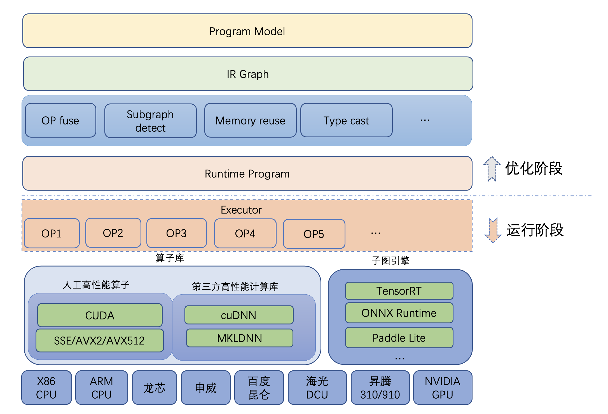

# Paddle Inference 简介

Paddle Inference 是飞桨的原生推理库， 提供服务器端的高性能推理能力。

由于 Paddle Inference 能力直接基于飞桨的训练算子，因此它支持飞桨训练出的所有模型的推理。

Paddle Inference 功能特性丰富，性能优异，针对不同平台不同的应用场景进行了深度的适配优化，做到高吞吐、低时延，保证了飞桨模型在服务器端即训即用，快速部署。

Paddle Inference 的整体架构如下：

## Paddle Inference 的高性能实现

### 内存 / 显存复用

在推理初始化阶段，对模型中的 OP 输出 Tensor 进行依赖分析，将两两互不依赖的 Tensor 在内存/显存空间上进行复用，降低内存 / 显存使用量，进而增大计算并行量，提升服务吞吐量。

### 细粒度 OP 横向纵向融合

在推理初始化阶段，按照已有的融合模式将模型中的多个 OP 融合成一个 OP，减少了模型的计算量的同时，也减少了 Kernel Launch 的次数，从而能提升推理性能。目前 Paddle Inference 支持的融合模式多达几十个。

### 内置高性能的 CPU / GPU Kernel

内置同 Intel、Nvidia 共同打造的高性能 kernel，保证了模型推理高性能的执行。

### 子图集成 TensorRT

Paddle Inference 采用子图的形式集成 TensorRT，针对 GPU 推理场景，TensorRT 可对一些子图进行优化，包括 OP 的横向和纵向融合，显存复用，多流并行，并为 OP 自动选择最优的 kernel，加快推理速度。

### 支持加载 PaddleSlim 量化压缩后的模型

PaddleSlim 是飞桨深度学习模型压缩工具，Paddle Inference 可联动 PaddleSlim，支持加载量化、裁剪和蒸馏后的模型并部署，由此减小模型存储空间、减少计算占用内存、加快模型推理速度。其中在模型量化方面，Paddle Inference 在 X86 CPU 上做了深度优化，常见分类模型的单线程性能可提升近 3 倍，ERNIE 模型的单线程性能可提升 2.68 倍。

## Paddle Inference 的通用性

### 主流软硬件环境兼容适配

支持服务器端 X86 CPU、NVIDIA GPU 芯片，兼容 Linux / Mac / Windows 系统。支持所有飞桨训练产出的模型，完全做到即训即用。

### 多语言环境丰富接口可灵活调用

支持 C++, Python, C, Golang，接口简单灵活，20行代码即可完成部署。对于其他语言，提供了 ABI 稳定的 C API, 用户可以很方便地扩展。

## 用户群

