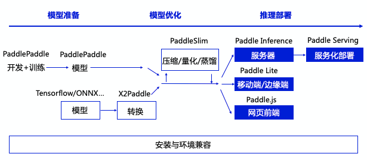

# 如何选择正确的推理引擎

作为飞桨生态重要的一部分，飞桨提供了多个推理产品，完整承接深度学习模型应用的最后一公里。

整体上分，推理产品主要包括如下子产品

| 名称               | 英文表示         | 适用场景                     |
|--------------------|------------------|------------------------------|
| 飞桨原生推理库     | Paddle Inference | 高性能服务器端、云端推理     |
| 飞桨服务化推理框架 | Paddle Serving   | 集成Paddle Inference，服务化部署、多模型管理等高阶功能  |
| 飞桨轻量化推理引擎 | Paddle Lite      | 移动端、物联网等             |
| 飞桨前端推理引擎   | Paddle.js        | 浏览器中推理、小程序等       |

各产品在推理生态中的关系如下

