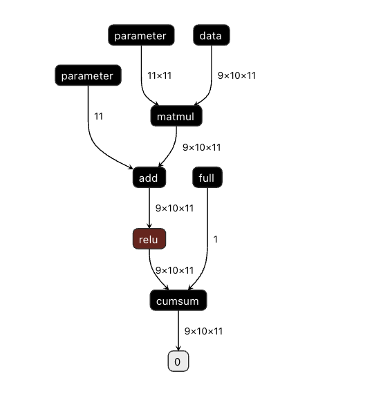
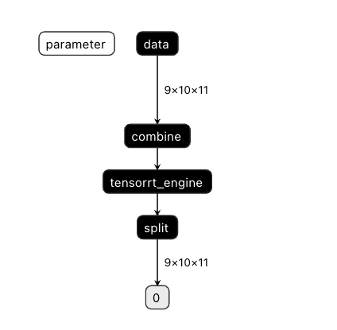

# GPU TensorRT 加速推理

- [GPU TensorRT 加速推理](#gpu-tensorrt-加速推理)
  - [1. 概要](#1-概要)
  - [2. 环境准备](#2-环境准备)
  - [3, API 使用介绍](#3-api-使用介绍)
  - [4, 低精度和量化推理](#4-低精度和量化推理)
  - [5. Paddle Inference 适配 TensorRT 原理介绍](#5-paddle-inference-适配-tensorrt-原理介绍)
  - [6. 基于pdmodel格式的旧架构 TensorRT 推理](#6-基于pdmodel格式的旧架构-TensorRT-推理)

<a name="1"></a>

## 1. 概要

TensorRT 是一个针对 NVIDIA GPU 及 Jetson 系列硬件的高性能机器学习推理 SDK，可以使得深度学习模型在这些硬件上的部署获得更好的性能。Paddle Inference 以子图方式集成了 TensorRT，将可用 TensorRT 加速的算子组成子图供给 TensorRT，以获取 TensorRT 加速的同时，保留 PaddlePaddle 即训即推的能力。在这篇文章中，我们会介绍基于 Paddle3.0 中间表示（PIR）的TensorRT推理（PIR-TRT）

PIR-TRT 功能实现主要由俩个部分组成，PIR-TRT 转换阶段和 PIR-TRT 推理阶段。在 PIR-TRT 转换阶段，原始模型（后缀为 **.json** 的模型文件）被加载后，神经网络被表示为由运算节点和其输入输出组成的 PIR 图，PIR-TRT Converter组件会对 PIR 图进行分析同时发现图中可以使用 TensorRT 优化的子图，并使用 TensorRT 节点替换它们，然后将带有 TensorRT 节点的图序列化下来。在模型的推理阶段，Paddle Inference 加载上述序列化后的模型，如果遇到 TensorRT 节点，Paddle Infenrence 会调用 TensorRT 对该节点进行执行，其它节点调用 GPU 原生推理。TensorRT 除了有常见的 OP 融合以及显存/内存优化外，还针对性地对 OP 进行了优化加速实现，降低推理延迟，提升推理吞吐。


PIR-TRT 支持动态 shape 输入，动态 shape 可用于输入 size 任意变化的模型，如动态 shape 的图像模型（FCN， Faster-RCNN）、 NLP 的 Bert/Ernie 等模型，当然也支持包括静态 shape 输入的模型。 PIR-TRT 支持fp32、fp16、int8 等多种计算精度，支持服务器端GPU，如T4、A30，也支持边缘端硬件，如 Jetson NX、 Jetson Nano、 Jetson TX2 等。 

<a name="2"></a>

## 2. 环境准备

要支持 PIR-TRT 功能，需要安装 CUDA、cuDNN、TensorRT 和对应版本的 Paddle 安装包。
关于这几个软件的安装版本，请参考如下建议（原因：CUDA、cuDNN、TensorRT 版本众多，且有严格的版本对应关系）：

- 电脑上 CUDA、cuDNN、TensorRT 都还没安装的开发者，建议参考 Paddle 提供的安装包信息，去安装对应版本的CUDA、cuDNN、TensorRT。
- 电脑上已安装 CUDA、cuDNN，但没有安装 TensorRT，建议参考 Paddle 提供的cuda、cudnn的对应版本的TensorRT版本去安装TensorRT。
- 电脑上已安装 CUDA、cuDNN、TensorRT的开发者，去下载对应版本的 Paddle 安装包。
  - 如果 Paddle 安装包没有对应版本的，一种方式是按照 Paddle 提供的安装包信息重新安装CUDA、cuDNN、TensorRT，一种是自己源码编译对应电脑上 CUDA、cuDNN、TensorRT 版本的 Paddle 包。从工程难易程度，建议选择第一种方案。

如果您需要安装 [TensorRT](https://developer.nvidia.com/nvidia-tensorrt-8x-download)，请参考 [TensorRT 文档](https://docs.nvidia.com/deeplearning/tensorrt/archives/index.html)。

关于 Paddle 的安装包，可以参考[Linux下PIP安装Paddle](https://www.paddlepaddle.org.cn/documentation/docs/zh/install/pip/linux-pip.html)

关于 Paddle 源码编译，可以参考[Linux 下使用 make 从源码编译](https://www.paddlepaddle.org.cn/documentation/docs/zh/install/compile/linux-compile-by-make.html)


**Note:**

1. 源码编译的时候，需要设置编译选项 WITH_TENSORRT 为 ON。另外可以设置编译选项 TENSORRT_ROOT 为 指定的 TensorRT SDK 的根目录，如果不设置将采用默认目录（"/usr"）。
2. 请确保 Python 版本的 TensorRT 正确安装。如果是从源码编译 Paddle 安装包，你可以设置编译选项 WITH_PIP_TENSORRT 为 ON ，在安装 Paddle whl包的时候系统会自动搜寻默认目录下 C++ 版本 TensorRT SDK，并自动安装对应 Python 版本的 TensorRT。
3. 当前3.0版本的 PIR-TRT 并不支持在 Windows 进行 TensorRT加速推理，如果需要在 Windows 上进行 TensorRT 加速，请参考第5小节内容。
4. 推荐使用的 TensorRT 的版本在 8.6 及以上，低于 8.5 版本的 TensorRT 功能将不可用。


<a name="3"></a>

## 3, API 使用介绍

PIR-TRT 功能实现分为俩个步骤，即模型转换（convert）阶段和运行推理阶段。

模型convert阶段作用将原始 PIR 表示模型结构（后缀为.json的模型文件）转换为带有TensorRT能力的 PIR 表示模型结构，在这个阶段中，Converter组件会对 PIR 图进行分析同时发现图中可以使用 TensorRT 优化的子图，并使用 TensorRT 节点替换它们，然后将带有 TensorRT 节点的图序列化下来。一个典型的convert阶段代码如下所示：

```python
    import numpy as np
    import paddle
    import paddle.nn.functional as F
    from paddle import nn
    from paddle.tensorrt.export import Input, TensorRTConfig

    class LinearNet(nn.Layer):
        def __init__(self, input_dim):
            super().__init__()
            self.linear = nn.Linear(input_dim, input_dim)

        def forward(self, x):
            return F.relu(self.linear(x))

    input_dim = 3
    # 1.Instantiate the network.
    layer = LinearNet(input_dim)

    save_path = "/tmp/linear_net"
    # 2.Convert dynamic graph to static graph and save as a JSON file.
    paddle.jit.save(layer, save_path, [paddle.static.InputSpec(shape=[-1, input_dim])])

    # 3.Create TensorRTConfig
    input_config = Input(
        min_input_shape=[1, input_dim],
        optim_input_shape=[2, input_dim],
        max_input_shape=[4, input_dim]
    )

    trt_config = TensorRTConfig(inputs=[input_config])
    trt_config.save_model_dir = "/tmp/linear_net_trt"

    # 4.Perform TensorRT conversion
    paddle.tensorrt.convert(save_path, trt_config)

```

示例中，步骤1和2过程是准备一个用来跑 TensorRT 加速推理的模型，这里创建了一个简单的动态图模型并且使用[动转静](https://www.paddlepaddle.org.cn/documentation/docs/zh/guides/jit/index_cn.html)方式保存下来为后续推理使用。步骤3创建了一个TensorRTConfig，用来给 TensorRT 做一些基础设置，这里Input设置了运行 TensorRT 所必须的输入min/opt/max shape，save_model_dir用于指定了convert后模型保存的路径。

在运行推理阶段，主要是通过使用convert后的模型进行推理，来获得 TensorRT 加速效果。在[上一节](./gpu_native_infer.md)中，我们了解到 Paddle Inference 推理流程（对 Paddle Inference 不熟悉请参考[这里](https://paddleinference.paddlepaddle.org.cn/quick_start/workflow.html)）包含了以下六步：

- 导入包
- 设置 Config
- 创建 Predictor
- 准备输入
- 执行 Predictor
- 获取输出

Paddle Inference 中推理阶段使用 TensorRT 加速也是遵照这样的流程，仅仅需要将 Config 中的加载的模型替换为上一步我们convert后保存的模型即可。示例代码如下：


```python
    import paddle
    import numpy as np
    import paddle.inference as paddle_infer
    
    # 5.Create a Predictor and run TensorRT inference.
    config = paddle_infer.Config(
        '/tmp/linear_net_trt.json',
        '/tmp/linear_net_trt.pdiparams',
    )
    config.enable_use_gpu(100, 0)
    predictor = paddle_infer.create_predictor(config)

    input_data = np.random.randn(2, 3).astype(np.float32)
    model_input = paddle.to_tensor(input_data)

    output_converted = predictor.run([model_input])
```


<a name="4"></a>

## 4, 低精度和量化推理

深度学习模型训练好之后，其权重参数在一定程度上是冗余的，在很多任务上，我们可以采用低精度或量化进行模型推理而不影响模型精度。这一方面可以减少访存、提升计算效率，另一方面，可以降低显存占用。采用 TensorRT 加速推理的方式也可支持 Fp32、Fp16 以及 Int8 量化推理。使用前，请参考[链接](https://docs.nvidia.com/deeplearning/tensorrt/support-matrix/index.html#hardware-precision-matrix)确保您的 GPU 硬件支持您使用的精度。


<a name="1"></a>

### Fp16 推理

为了使用 TensorRT 利用半精度进行混合精度推理，需将制定精度类型参数设定为半精度。
以第三节中的代码示例为例子，只需要对```TensorRTConfig```设置```precision_mode```，便可开启 FP16 推理。
```python
from paddle.tensorrt.export PrecisionMode

trt_config.precision_mode = PrecisionMode.FP16
```


<a name="2"></a>

### Int8 量化推理

使用 Int8 量化推理的流程可以分为两步：（1）产出量化模型。（2）使用量化模型进行 TensorRT 加速推理。下面我们对使用 PIR-TRT 进行 Int8 量化推理的完整流程进行详细介绍。

**1. 产出量化模型**

目前，PIR-TRT 支持模型压缩工具库 PaddleSlim 产出的量化模型。PaddleSlim 支持离线量化和在线量化功能。离线量化的优点是无需重新训练，简单易用，但量化后精度可能受影响；量化训练的优点是模型精度受量化影响较小，但需要重新训练模型，使用门槛稍高。具体使用PaddleSlim产出量化模型可以参考文档：
  
  - 离线量化 [快速开始教程](https://github.com/PaddlePaddle/PaddleSlim/blob/release/2.3/docs/zh_cn/quick_start/static/quant_post_static_tutorial.md)
  - 离线量化 [API 接口说明](https://github.com/PaddlePaddle/PaddleSlim/blob/release/2.3/docs/zh_cn/api_cn/static/quant/quantization_api.rst)
  - 离线量化 [Demo](https://github.com/PaddlePaddle/PaddleSlim/tree/release/2.3/demo/quant/quant_post)
  - 量化训练 [快速开始教程](https://github.com/PaddlePaddle/PaddleSlim/blob/release/2.3/docs/zh_cn/quick_start/dygraph/dygraph_quant_aware_training_tutorial.md)
  - 量化训练 [API 接口说明](https://github.com/PaddlePaddle/PaddleSlim/blob/release/2.3/docs/zh_cn/api_cn/dygraph/quanter/qat.rst)
  - 量化训练 [Demo](https://github.com/PaddlePaddle/PaddleSlim/tree/release/2.3/demo/quant/quant_aware)


**2. 使用量化模型进行 TensorRT Int8 推理**       


为了加载量化模型进行 TensorRT Int8 推理，需要在指定 TensorRT 配置时，对```TensorRTConfig```设置```precision_mode```，PIR-TRT 其他流程不需要变，便可开启 Int8 推理
```python
from paddle.tensorrt.export PrecisionMode

trt_config.precision_mode = PrecisionMode.INT8
```

Int8 量化推理的完整 demo 请参考[链接](https://github.com/PaddlePaddle/Paddle-Inference-Demo/tree/master/c%2B%2B/gpu/resnet50)。


<a name="5"></a>

## 5. Paddle Inference 适配 TensorRT 原理介绍

PIR-TRT 采用子图的形式对 TensorRT 进行集成，当模型加载后，神经网络可以表示为由运算节点及其输入输出组成的 PIR 计算图。PIR-TRT 对整个图进行扫描，发现图中可以使用 TensorRT 优化的子图，并使用 TensorRT 节点替换它们。在模型的推断期间，如果遇到 TensorRT 节点，Paddle Inference 会调用 TensorRT 库对该节点进行优化，其他的节点调用 Paddle Infenrence 的 GPU 原生实现。TensorRT 在推断期间能够进行 Op 的横向和纵向融合，过滤掉冗余的 Op，并对特定平台下的特定的 Op 选择合适的 Kernel等进行优化，能够加快模型的推理速度。  

下图使用一个简单的模型展示了这个过程：  

**原始网络**



**转换的网络**



原始网络是由matmul，add，relu等算子组合成的一个简单网络。PIR-TRT 会对网络进行检测并将matmul，add，relu等算子作为一个可转换子图选出来，由一个 TensorRT 节点代替，成为转换后网络中的 **tensorrt_engine** 节点，并且在该节点之前添加一个 combine 节点，方便将输入汇总传给 tensorrt_engine，在该节点之后添加一个 split 节点，方便将输出分发给其他节点。在网络运行过程中，如果遇到tensorrt_engine，Paddle Inference 将调用 TensorRT 来对其执行。


<a name="6"></a>

## 6. 基于pdmodel模型格式的 TensorRT 推理

在Paddle 3.0 版本之后，飞桨底层升级为全新的 PIR 架构，保存的模型结构以.json后缀的模型为主。虽然 3.0 进行了全面升级，但是出于兼容性考虑依然保留着旧架构的功能，即如果想在 Paddle 3.0 下对于保存的模型后缀为.pdmodel格式进行 TensorRT 加速推理，可以参考 [Paddle 2.x TensorRT 推理文档](https://www.paddlepaddle.org.cn/inference/v2.6/guides/nv_gpu_infer/gpu_trt_infer.html)；如果是使用 Paddle 3.0 新架构下保存的模型（.json后缀）进行 TensorRT 推理加速，则需要参考本章节介绍的 PIR-TRT 使用方法。