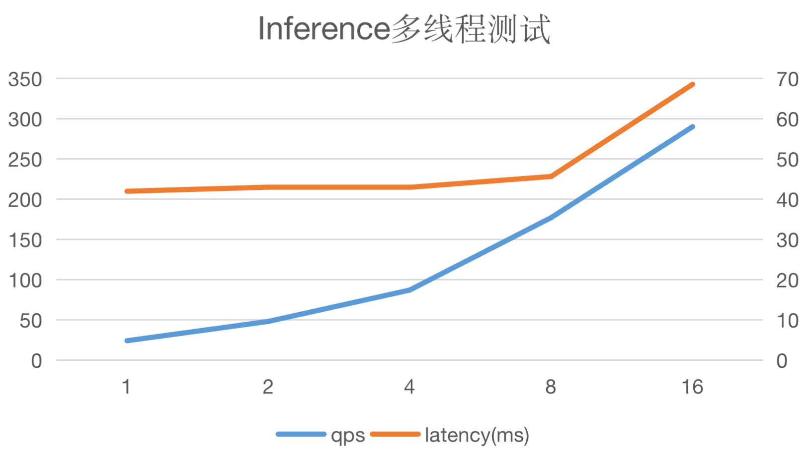

# 多线程并发推理

单线程的推理服务，往往由于无法实现较高QPS，而导致GPU利用率过低。利用多线程实现并发推理，能提高推理服务的吞吐量，实现推理服务的优化。

## 利用多线程来实现并发推理

## 使用示例

下面的示例以C++为例。

### 多线程实现
- 1、创建Predictor
```
  auto main_predictor = paddle_infer::CreatePredictor(config);
```
- 2、创建多个推理线程并执行
```
  std::vector<decltype(main_predictor)> predictors;

  for (int i = 0; i < FLAGS_thread_num - 1; ++i) {
    predictors.emplace_back(std::move(main_predictor->Clone()));
  }
  predictors.emplace_back(std::move(main_predictor));

  std::vector<std::thread> threads;
  auto begin = time();
  for (int i = 0; i < FLAGS_thread_num; ++i) {
    threads.emplace_back(Run, predictors[i], i);
  }
```
Run() 为线程执行函数，以下代码片段供参考。
```
  void Run(std::shared_ptr<Predictor> predictor, int thread_id) {

  auto run_one_loop = [&](int batch_size) {
    // input
    int channels = 3;
    int height = 224;
    int width = 224;
    int input_num = channels * height * width * batch_size;
    std::vector<float> in_data(input_num, 0);
    for (int i = 0; i < input_num; ++i) {
      in_data[i] = i % 255 * 0.1;
    }
    auto in_names = predictor->GetInputNames();
    auto in_handle = predictor->GetInputHandle(in_names[0]);
    in_handle->Reshape({batch_size, channels, height, width});
    in_handle->CopyFromCpu(in_data.data());

    CHECK(predictor->Run());

    // output
    auto out_names = predictor->GetOutputNames();
    auto out_handle = predictor->GetOutputHandle(out_names[0]);
    std::vector<float> out_data;
    std::vector<int> out_shape = out_handle->shape();
    int output_num = std::accumulate(out_shape.begin(), out_shape.end(), 1,
                                     std::multiplies<int>());
    out_data.resize(output_num);
    out_handle->CopyToCpu(out_data.data());
    float mean_val = std::accumulate(out_data.begin(), out_data.end(),
                                     decltype(out_data)::value_type(0));
    // std::cout << "mean: " << mean_val << std::endl;
  };

  for (int i = 0; i < FLAGS_loop_times; ++i) {
    run_one_loop(FLAGS_batch_size);
  }
}
```

### 使用PredictorPool的多线程实现

Paddle Inference提供了Predictor线程池的封装。
- 1、创建Predictor Pool
  ```
  paddle_infer::services::PredictorPool pred_pool(config, thread_num);
  ```
- 2、创建多个推理线程并执行
  ```
  std::vector<std::thread> threads;
  auto begin = time();
  for (int i = 0; i < FLAGS_thread_num; ++i) {
    threads.emplace_back(Run, pred_pool.Retrive(i), i);
  }
  ```
  Run() 为线程执行函数，同上。

  ## 多线程并发推理测试
  - 测试环境
    - NVIDIA® T4 GPU
    - CUDA 11.2.2
    - cuDNN 8.2.1
    - PaddlePaddle 版本：v2.3
  - 测试结果
  
  此处使用MobileNetV1进行测试，batch_size设定为1，线程数从1递增至16。可以看出QPS与线程数呈线性关系，同时请求latency变化不大。