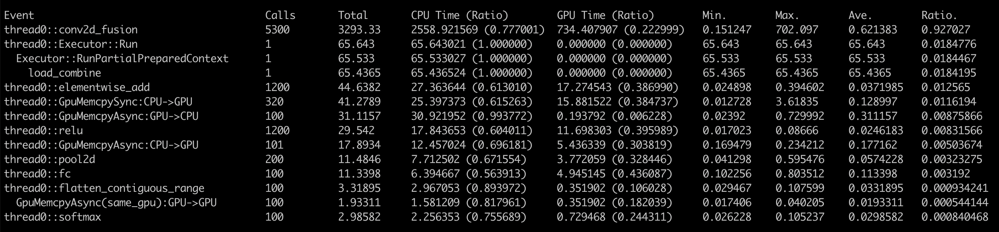
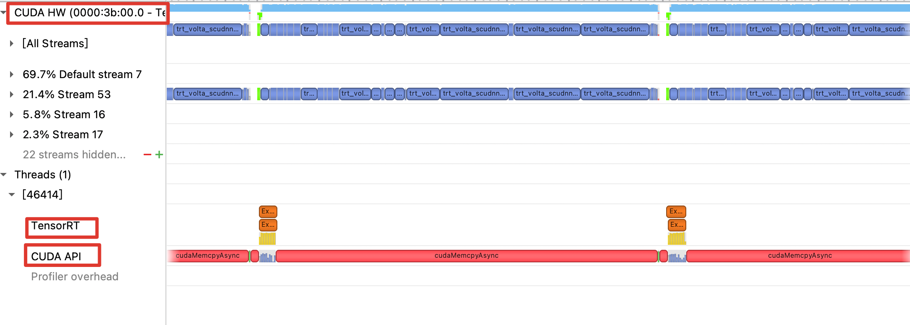
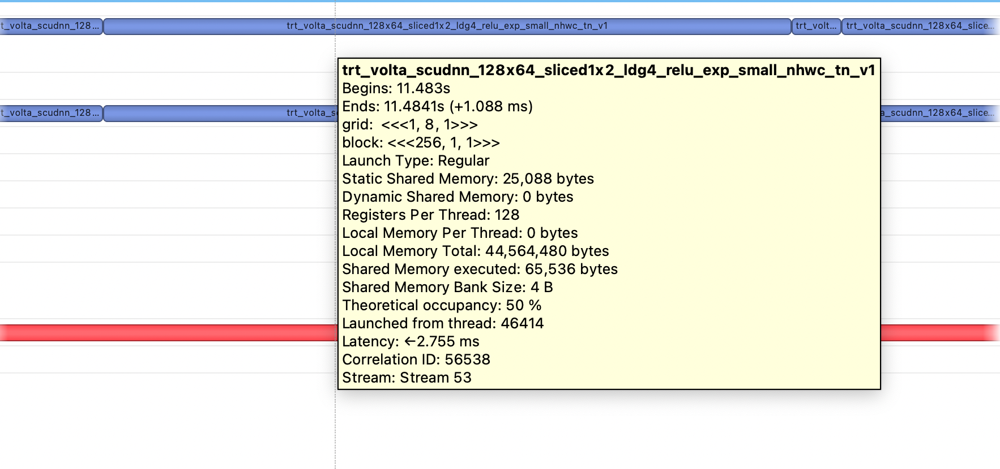
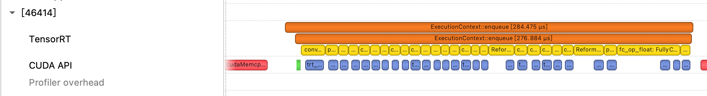
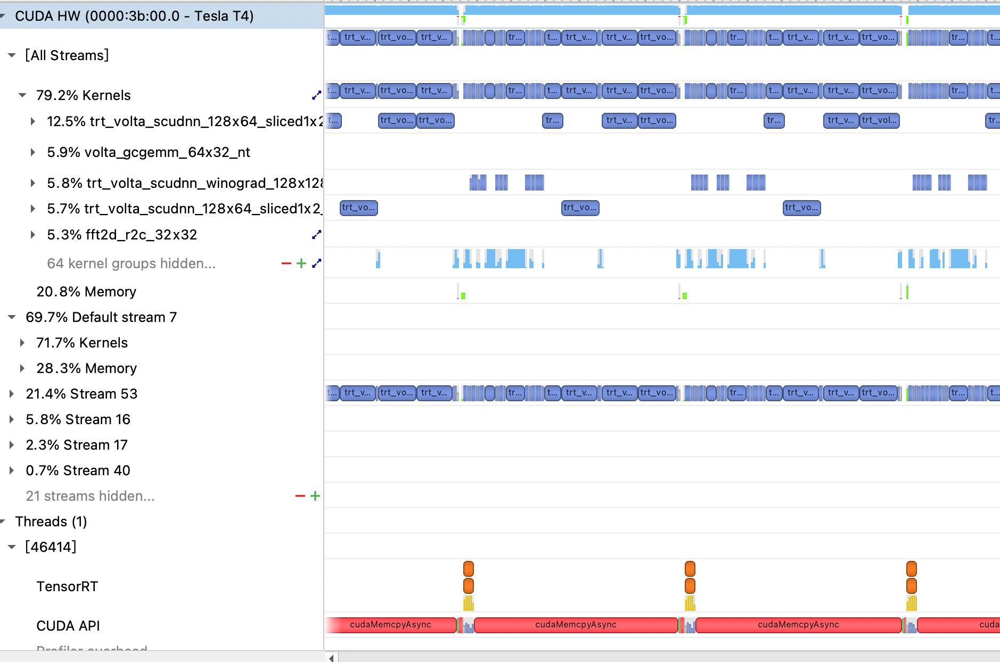

# 性能分析

本文档将向您介绍如何使用性能分析工具定位推理部署过程中的性能瓶颈，以方便进行深度优化。

## 1 框架 Profile 工具
通过使用 Paddle Inference 提供的 Profile 工具可以查看 timeline，用于定位 CPU 和 GPU 的瓶颈，开启 Profile，需要在 config 中设置对应的指令:

(1) c++ API
```c++
config.EnableProfile() 
```
(2) python API
```c++
config.enable_profile()
```
推理完成后会得到完整的 Profile 数据报告，其中包括整体计算和框架耗时占比、详细的 OP 耗时占比以及内存使用情况。
应该重点分析的是每个 OP 的耗时占比，详细输出信息如下图，其中：

(1) Calls，调用次数

(2) Total，CPU 时间 + GPU 时间

(3) CPU 时间，准确

(4) GPU 时间，准确

(5) Min、Max、Ave，最大、最小、平均时间

(6) Ratio，Total 时间占比

CPU 和 GPU 耗时较为准确，可作为性能分析的参考。我们可以通过分析各部分耗时来判断性能瓶颈是由 CPU 还是 GPU 导致，得到最大耗时对应的 OP，精确统计指定 C++ 代码的开销。



## 2 NVIDIA Nsight Systems 性能分析工具
NVIDIA Nsight Systems 是一种系统级别的调优工具，能够对程序使用到的 GPU、DLA、CPU、显存、线程等数据进行可视化，以帮助用户调查瓶颈，优化性能。 NVIDIA 官方提供了 [Nsight Systems 数据手册](https://docs.nvidia.com/nsight-systems/UserGuide/index.html)。

### 2.1 Nsight Systems 使用
(1) Linux 服务器/ Jetson 设备

首先，需要在 [Nsight Systems 官网](https://developer.nvidia.com/nsight-systems) 下载对应 Linux 版本的安装包，执行安装命令即可完成安装。


```c++
 //.run 安装包
 sh NsightSystems-linux-public-xxx.run --accept --quiet
 //.deb 安装包
 dpkg -i NsightSystems-linux-public-xxx.deb 
```
然后，在 Linux 终端使用 nsys 命令进行 Profile 产生基础数据，以运行 resnet 为例说明 nsys 命令使用方法。
```c++
 nsys profile -o output ./resnet
```
之后，会生成 output.qdrep 文件，最后拷贝到 Host 机器（Mac、Linux、Windows）上，使用 Nsight Host 进行图形化展示。

(2) Windows 服务器

在 Windows 服务器上使用 Nsight Systems 工具，无需在终端生成 .qdrep 文件，点击左上角 File --> New Project，连接好服务器、添加好可执行文件以及可视化内容选项设置好，点击 Start 即可完成 Profile 过程。

### 2.2 Nsight Systems 结果分析

在 Mac / Windows 上安装好图形化查看界面 Nsight Host，打开生成的 .qdrep 文件，就可以查看运行的 timeline，可重点分析 CUDA HW、TensorRT 以及 CUDA API 这三部分。



(1) CUDA HW 包含了所有运行的 GPU Kernel 计算单元。在界面中放大可以查看所有时间段，选中某次运行的时间段，Nsight Systems 会自动显示该时间段运行 kernel 的详细数据信息，包括执行时间、内存申请以及所在流等。



(2) TensorRT 以及 CUDA API 包含了 所有 GPU Kernel Launch 的过程。



(3) 将左侧菜单栏展开，还会得到更加详细的 Kernel 计算占比以及多 Stream 使用情况。
 


### 2.3 Nsight Systems 分析技巧

(1) Kernel 名字包含特定信息。例如 TensorRT 的 Kernel 会以 trt 开头；TensorRT 使用 fp16 的 Kernel 会包含 884 或 1688 字样，int8 会包含 int8。

(2) 循环运行多次，方便定位运行周期。因为初始化阶段和 TensorRT 的 build 阶段默认也会被 Profile，可以通过循环运行多次 run（例如 500、1000），方便在 timeline 中准确定位一个完整的运行周期。

(3) 重点关注 Kernel 相对时长。由于 timeline 上的时间一般会比实际运行时间长一些，重点关注 Kernel 之间的时长对比即可。


