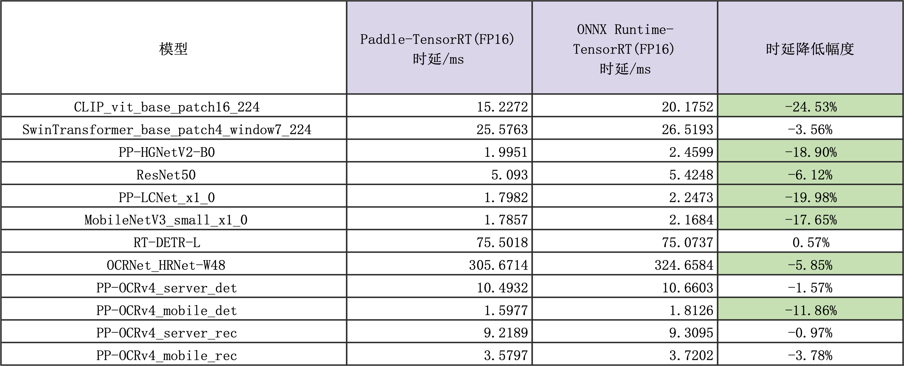

# 性能数据

## 测试环境和版本信息

- CPU: Intel(R) Xeon(R) Gold 6271C CPU @ 2.60GHz
- GPU: NVIDIA Tesla T4
- CUDA: 11.8
- cuDNN: 8.9
- TensorRT: 8.5.3.1
- PaddlePaddle: develop(d51a18cd03cea0932ac760aa14790f5a84300210)
- ONNX Runtime: 1.20.0

## 数据
