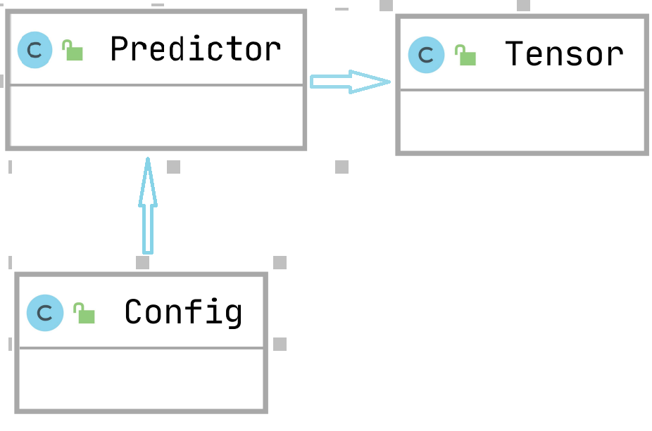

##### 1、主体设计思路与折衷
###### 整体全貌

飞桨推理产品paddle inference和主框架的Model.predict均可实现推理预测，Paddle Inference 是飞桨的原生推理库， 作用于服务器端和云端，提供高性能的推理能力，主框架的Model 对象是一个具备训练、测试、推理的神经网络。

本方案实施后会增加paddle inference在Java中部署推理的能力

<h4 align="center">LeViT</h4>

