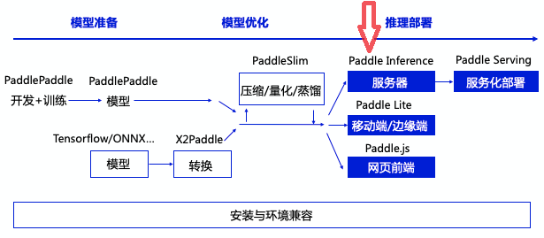
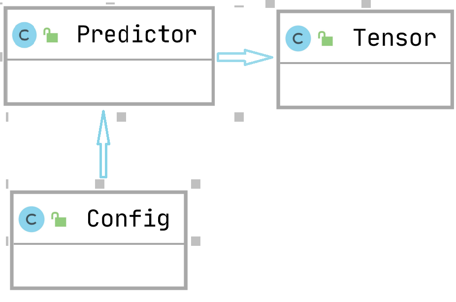

#### 一、概要

##### 1、相关背景 

Paddle Inference 当前支持五种编译语言 C++/Python/C/Go/R。Paddle Inference有 良好的解耦设计，使得我们可以较容易的支持 多种语言作为用户接口，自然也可以支持更多的语言作为用户接口。

##### 2、功能目标

为Paddle Inference 添加 Java API ，能通过Java调用Paddle Inference，完成配置Config信息、模型加载、创建Predictor对象、输入数据赋值、执行推理、获取输出数据等主要功能。通过Java API ，Java程序员可以使用简单灵活的Java接口，完成Java后端测的Paddle Inference部署。

##### 3、方案要点

- Paddle Inference Java API 基于 capi 实现。
- Java 对 c 的调用基于 JNI 实现。
- Java 与 c 的数据结构转换、对象的引用基于 JNI工具函数实现。

#### 二、参考实现 

我们主要参考[Paddle Lite Java](https://github.com/PaddlePaddle/Paddle-Lite/tree/develop/lite/api/android)实现 Paddle Inference Java。同时了解[TensorFlow Java](https://github.com/tensorflow/tensorflow/tree/master/tensorflow/java)、[Pytorch Android](https://github.com/pytorch/pytorch/tree/master/android/pytorch_android)。

##### 1.  Paddle Lite Java

接口的设计、推理流程与本项目最为相近。文档完善，更新不活跃。

##### 2.  TensorFlow Java

接口的设计、推理流程基于TensorFlow 1，静态图设计比较复杂。文档完善，依赖引入容易，更新不活跃。

##### 3.  Pytorch Android

接口的设计、推理流程基于PyTorch，与本项目流程有相似之处。文档完善，更新较不活跃。

#### 三、设计思路与实现方案

##### 1、主体设计思路与折衷
###### 整体全貌

飞桨推理产品paddle inference和主框架的Model.predict均可实现推理预测，Paddle Inference 是飞桨的原生推理库， 作用于服务器端和云端，提供高性能的推理能力，主框架的Model 对象是一个具备训练、测试、推理的神经网络。



本方案实施后会增加paddle inference在Java中部署推理的能力

###### 主体设计具体描述



基于paddle inference c预测库，通过Java Jni实现Java代码与C、C++代码交互，使得Java程序员通过简单的Java接口完成Java后端预测的Paddle部署。

Config类：`Config` 对象相关方法用于创建预测相关配置，构建 `Predictor` 对象的配置信息，如模型路径、是否开启gpu等等。

Predictor类：Paddle Inference 的预测器，由 `createPaddlePredictor` 根据 `Config` 进行创建。用户可以根据 Predictor 提供的接口设置输入数据、执行模型预测、获取输出等。

Tensor类：Tensor 是 Paddle Inference 的数据组织形式，用于对底层数据进行封装并提供接口对数据进行操作，包括设置 Shape、数据等。

###### 主体设计选型考量

JNI（Java Native Interface，Java本地接口）是一种编程框架，使得Java虚拟机中的Java程序可以调用本地应用/或库，参考了paddle inference已有预测库的接口实现和paddle Lite中的JNI相关代码。

##### 2、关键技术点/子模块设计与实现方案

###### JNI调用C预测库

利用JNI技术生成.java文件对应的.h文件，引入.h文件编写本地方法调用C预测库，JNI编译.so文件生成的Java的动态库动态依赖C预测库。

###### JAVA和Native层对象管理和同步：

指向底层对象的指针伪装成Java的long，保存在Java对象中：

```java
private long cppPaddleConfigPointer;
```

在Java类的构造函数中，调用Native层的构造函数，分配Native Heap的内存空间，之后，在Java类的finalize方法中调用Native层的析构函数，回收Native Heap的内存空间：

```java
    public Config() {
        this.cppPaddleConfigPointer = createCppConfig();
    }

    @Override
    protected void finalize() throws Throwable {
        destroyNativeConfig();
    }

    public void destroyNativeConfig() {
        if(cppPaddleConfigPointer != 0) cppConfigDestroy(cppPaddleConfigPointer);
        cppPaddleConfigPointer = 0;
    }
```

###### JNI内存管理

通过env->Get***Elements获得Java对象的深拷贝或者浅拷贝（取决于Java虚拟机的实现），转化为c语言中的局部变量，再释放Java对象的拷贝：

```java
inline std::string jstring_to_cpp_string(JNIEnv *env, jstring jstr) {
  if (!jstr) {
    return "";
  }
  const jclass stringClass = env->GetObjectClass(jstr);
  const jmethodID getBytes =
      env->GetMethodID(stringClass, "getBytes", "(Ljava/lang/String;)[B");
  const jbyteArray stringJbytes = (jbyteArray)env->CallObjectMethod(
      jstr, getBytes, env->NewStringUTF("UTF-8"));

  size_t length = static_cast<size_t>(env->GetArrayLength(stringJbytes));
  jbyte *pBytes = env->GetByteArrayElements(stringJbytes, NULL);

  std::string ret = std::string(reinterpret_cast<char *>(pBytes), length);
  env->ReleaseByteArrayElements(stringJbytes, pBytes, JNI_ABORT);

  env->DeleteLocalRef(stringJbytes);
  env->DeleteLocalRef(stringClass);
  return ret;
}
```

##### 3、主要影响的模块接口变化
###### 请列出核心设计对应的直接接口变化

##### Predictor 方法

Paddle Inference 的预测器，由 `createPaddlePredictor` 根据 `Config` 进行创建。用户可以根据 Predictor 提供的接口设置输入数据、执行模型预测、获取输出等。

##### 创建 Predictor

```java
// 构造方法，创建Predictor
// 参数：config - 用于构建 Predictor 的配置信息
// 返回：Predictor对象
public static Predictor createPaddlePredictor(Config config);
```

##### 输入输出与执行预测

API 定义如下：

```java
// 获取模型输入 Tensor 的数量
// 参数：无
// 返回：long - 模型输入 Tensor 的数量
public long getInputNum()

// 获取模型输出 Tensor 的数量
// 参数：无
// 返回：long - 模型输出 Tensor 的数量
public long getOutputNum()

// 获取输入 Tensor 名称
// 参数：long - 模型输入 Tensor 的id
// 返回：String - 输入 Tensor 名称
public String getInputNameById(long id)

// 获取输出 Tensor 名称
// 参数：long - 模型输出 Tensor 的id
// 返回：String - 输出 Tensor 名称
public String getOutputNameById(long id)

// 获取输入 handle
// 参数：name - 输入handle名称
// 返回：Tensor - 输入 handle
public Tensor getInputHandle(String name)

// 获取输出 handle
// 参数：name - 输出handle名称
// 返回：Tensor - 输出 handle
public Tensor getOutputHandle(String name)

// 执行预测
// 参数：无
// 返回：None
public boolean run()

// 释放中间Tensor
// 参数：None
// 返回：None
public void clearIntermediateTensor()

// 释放内存池中的所有临时 Tensor
// 参数：None
// 返回：None
public void tryShrinkMemory()
```

Config和Tensor相关接口类似Paddle Inference C预测库对应接口，可参考Paddle Inference C预测库和API接口文档。

###### 请逐一排查对对框架各环节的影响

对网络定义、底层数据结构、OP、数据IO、执行、分布式、模型保存没有影响；预测部署环节的可以直接使用本项目在JAVA中进行开发。

##### 4、测试和验收的考量
自测方案：代码测试

目标达成验收的度量方式：代码审查，代码测试，CI测试

#### 四、示例
```java
import com.baidu.paddle.inference.Predictor;
import com.baidu.paddle.inference.Config;
import com.baidu.paddle.inference.Tensor;

public class test {

    static {
        System.loadLibrary("paddle_inference");
    }

    public static void main(String[] args) {
        Config config = new Config();

        config.setCppModel(args[0], args[1]);
        config.enableMemoryOptim(true);
        config.enableProfile();
        config.enableMKLDNN();
        try {
            System.out.println(config.getCppModelDir());
            System.out.println(config.getCppParamsFile());
            System.out.println(config.getProgFile());
        } catch (Exception e) {
            e.printStackTrace();
        }
        config.getCpuMathLibraryNumThreads();
        config.getFractionOfGpuMemoryForPool();
        config.switchIrDebug(true);
        System.out.println(config.summary());

        Predictor predictor = Predictor.createPaddlePredictor(config);

        long n = predictor.getInputNum();

        String inNames = predictor.getInputNameById(0);

        Tensor inHandle = predictor.getInputHandle(inNames);

        inHandle.reshape(4, new int[]{1, 3, 224, 224});

        float[] inData = new float[1*3*224*224];
        inHandle.copyFromCpu(inData);
        predictor.run();
        String outNames = predictor.getOutputNameById(0);
        Tensor outHandle = predictor.getOutputHandle(outNames);
        float[] outData = new float[outHandle.getSize()];
        outHandle.copyToCpu(outData);

        predictor.tryShrinkMemory();
        predictor.clearIntermediateTensor();

        System.out.println(outData[0]);
        System.out.println(outData.length);

        outHandle.destroyNativeTensor();
        inHandle.destroyNativeTensor();
        predictor.destroyNativePredictor();
    }
}
```

#### 五、影响和风险总结 @yyds @晓伟
#### 对用户的影响
在为Paddle Inference添加完Java前端语言后，用户可以直接以导入jar包的方式十分便捷的在自己的Java项目中使用Paddle Inference强大的深度学习推理能力。通过调用简单灵活的Java接口来完成对深度学习模型的配置、推理等功能。使用户有能力用AI赋能自己的Java项目。
#### 对框架架构的影响
Paddle Inference的Java前端，作为Paddle Inference面向Java程序开发者的用户接口，在不改变Paddle Inference框架架构的前提下，拓展了Paddle Inference框架的能力范围。
#### 对性能的影响
Paddle Inference的Java前端使用JNI调用Paddle Inference本地C语言api，不会对Paddel Inference性能产生影响。
#### 其他风险
暂未发现其他可能的风险。
#### 六、规划排期 @yyds
#### **时间安排：**

2021年9月23日~2021年10月19日：进行任务调研
2021年10月20日：github提交RFC文档
2021年10与21日~11月11日：编写代码实现Java前端
2021年11月12日：提交第一版代码至github
2021年11月13日~12月9日：按照review意见修改代码
2021年12月10日：代码通过相关负责人审核
2021年12月11日~12月21日：完成代码合入相关工作

#### **人力安排：**

陈彦岚：负责方案制定、项目代码的提交、代码的编写及测试
吴宙思：负责方案制定、项目代码的编写
李奇松：负责方案制定、开发测试环境准备及编译相关工作